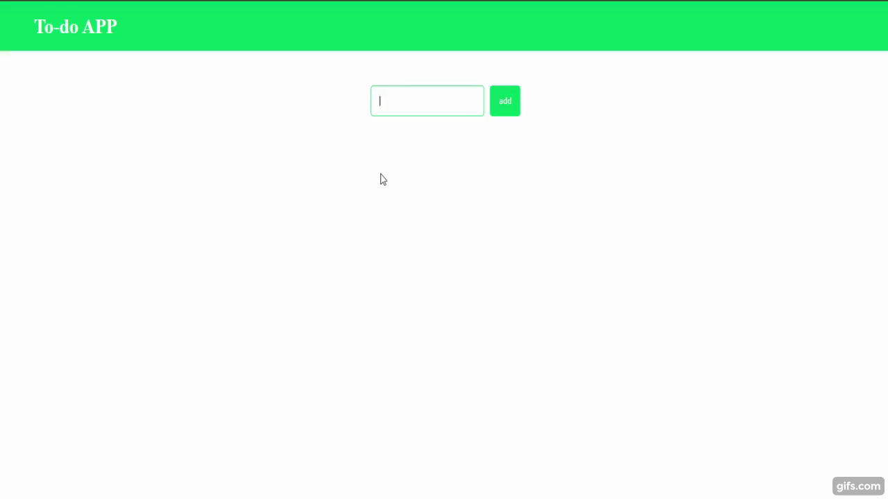
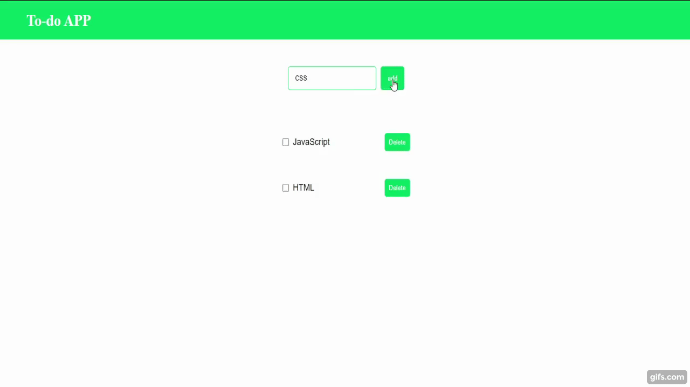
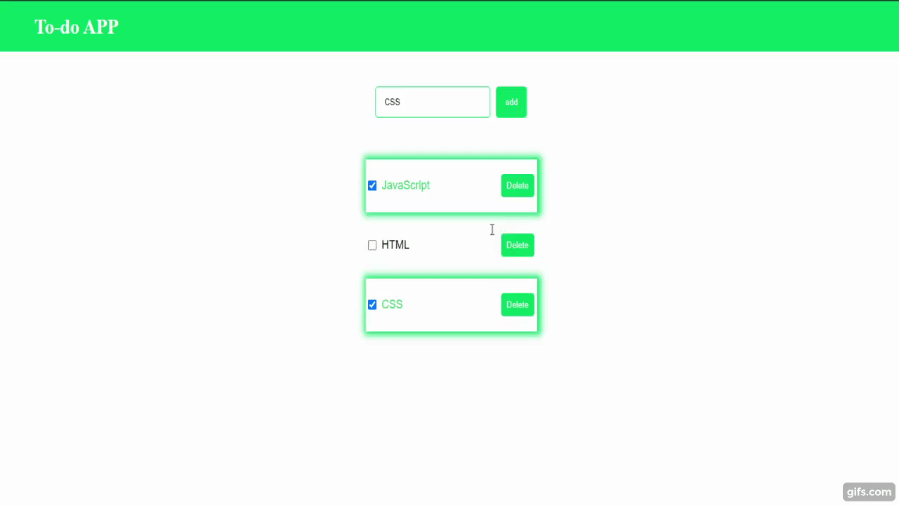
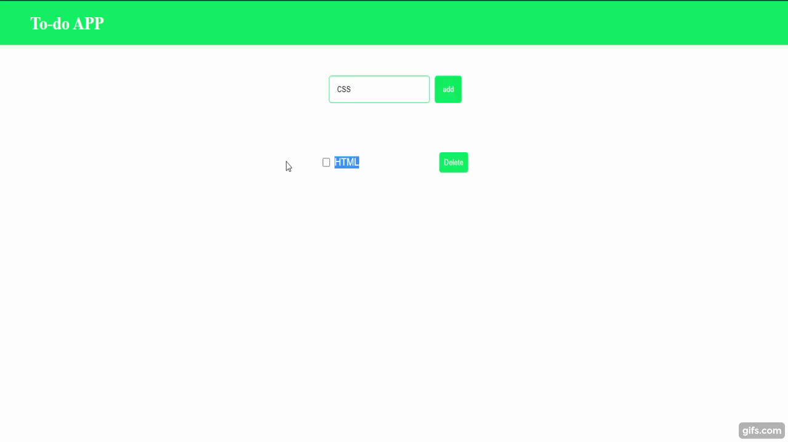

# ToDoApp
To-Do-App utilizando HTML, CSS e JavaScript.

O Usuário podera adicionar um elemento, editar, marcar como feito e excluir.
Tambem foi utilizado o localStorage para as informações ficarem salvas no navegador.

## Adicionar

## Marcar

## Excluir

## Editar

